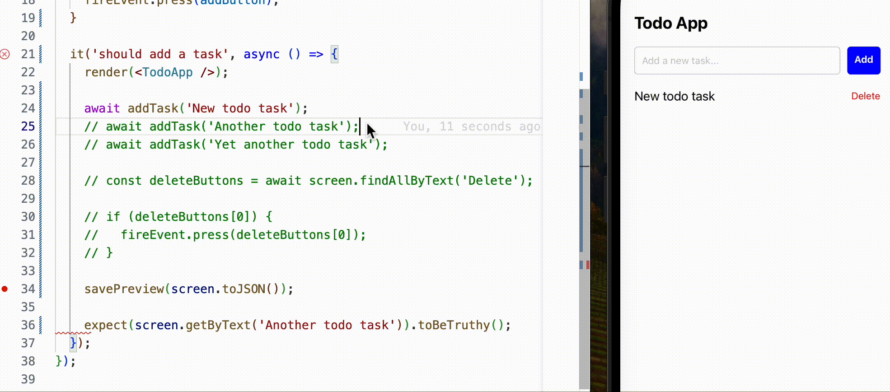

# React native test preview

<p align="center">
  Utility that allows visualization of component tests.
</p>

<p align="center">
  
</p>

## Features

- Preview your app state while writing tests
- Auto reload the screen when your test executes
- Supports all style libraries out the box
- Supports external libraries with `registerComponent`

## How to use

`npm i react-native-test-preview`

In your App.tsx file:
```diff
+import { TestPreviewComponent } from 'react-native-test-preview/lib/commonjs/setup';

function App() {
  //...
-  return ...;
+  return <TestPreviewComponent />;
}
```

And in your test files:

```diff
+import savePreview from 'react-native-test-preview/lib/commonjs/savePreview';

describe('App', () => {
  it('should work as expected', () => {
    render(<App />);
+   savePreview(screen.toJSON());
  });
});
```

## Caveats

If you test components that have external libraries with custom native components, like ReactNativeMaps, you have to register them with `registerComponent` fn.

Example:
```jsx
import { registerComponent } from 'react-native-test-preview/lib/commonjs/setup';
import MyLibraryComponent from 'external-library';

registerComponent(MyLibraryComponent)
```
or
```jsx
import { registerComponent } from 'react-native-test-preview/lib/commonjs/setup';
import MyLibraryComponent from 'external-library';

registerComponent(MyLibraryComponent, { prop1: value, prop2: value2 })
```

## Contribution

See the Contribution Guide at [CONTRIBUTING.md](/CONTRIBUTING.md)
